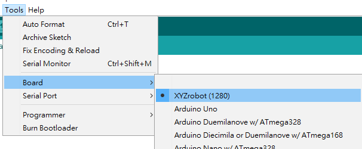
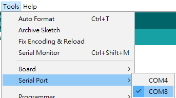
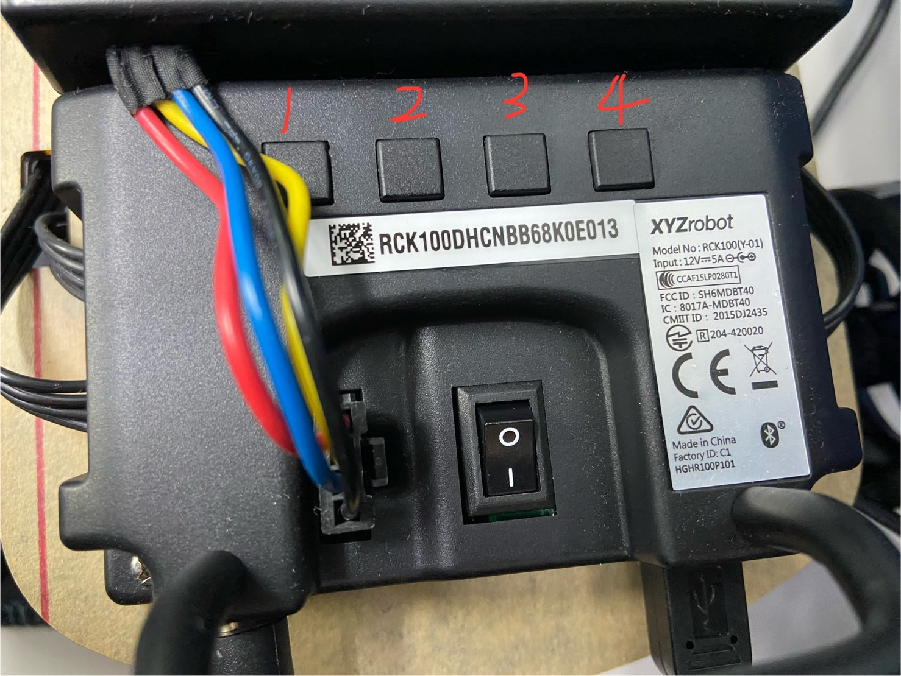
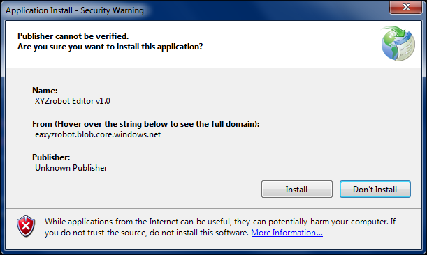
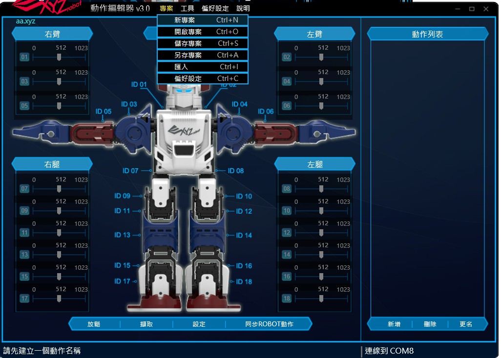
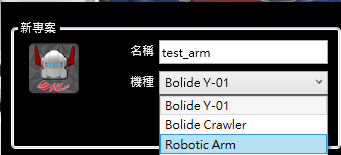

# XYZRobot
# 軟體安裝

## Arduino 1.0.6 免安裝版與環境安裝
1. 解壓縮 arduino-1.0.6-windows.zip
2. 將hardware中的XYZrobot 複製到 arduino-1.0.6//hardware
3. 將library中的BOLIDE_Player 複製到 arduino-1.0.6//libraries

### 範例程式
1. 將手臂連接電腦
2. 機械手臂6軸+車車：用Arduino 1.0.6開啟 Firmware//RCK100_6DOF_WHEEL//RCK100_6DOF_WHEEL.ino

   機械手臂6軸：用Arduino 1.0.6開啟 Firmware//RCK100_6DOF//RCK100_6DOF.ino
3. 於上方工具列點擊Tools > Board，選擇 XYZrobot(1280)

   
5. 於工具列點選Tool > Serial Port並選擇手臂相對應的選項(ex:COM8)

   

6. 編譯並上傳程式碼

## 範例程式成果
對應板子上的按鈕有不同的功能

1. 功能一

2. 功能二

3. 功能三

4. 功能四

## 動作編輯器安裝
1. 解壓縮 動作編輯器V3_離線版_V3.19.0520.1.zip
2. 點擊執行setup.exe
3. 點擊Install安裝動作編輯器

## 動作編輯器操作範例
1. 點擊新專案

3. 選擇機種與創建名稱

